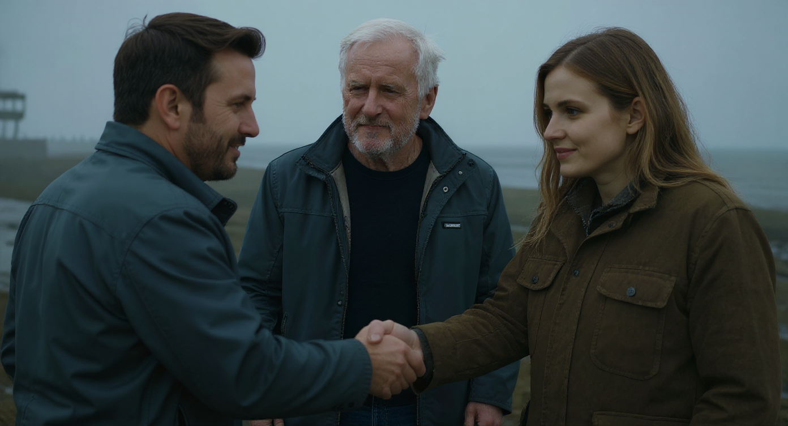
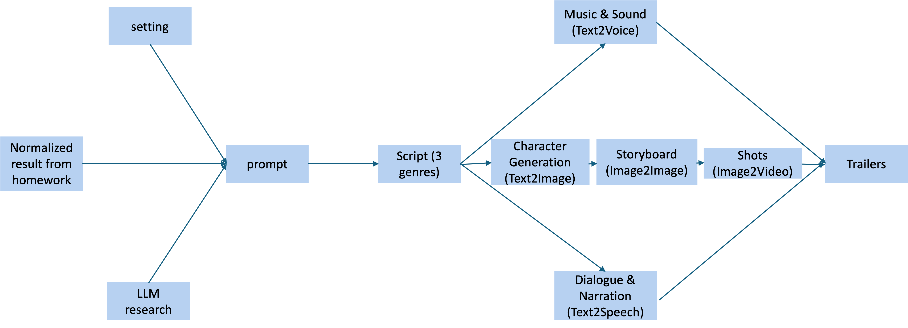
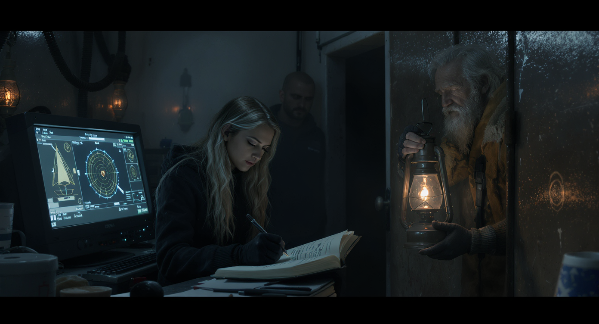
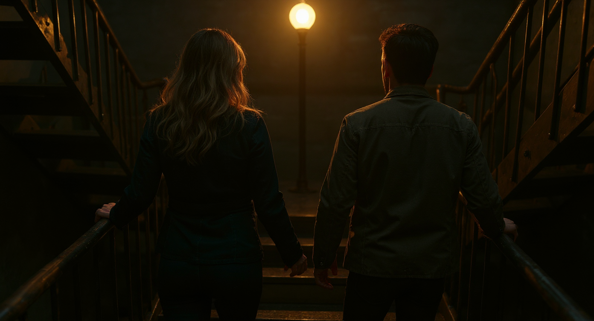

# tum_nlp-projektwoche
<p align="center">
  
</p>

This repository contains codes used for film trailer generation in "NLP Projektwoche course". The final results of our work are in the `assets` folder.


### Table of Content
- [Setup](#setup)
- [Development](#development)
- [Results](#results)
    - [Preliminary Homework](#preliminary-homework)
    - [Audio Analysis Homework](#audio-analysis-homework)
    - [Trailer Generation](#trailer-generation)


## Setup
- First, install the `uv` Python package manager. Follow the official [uv documentation](https://docs.astral.sh/uv/getting-started/installation/) for installation instructions.
- `conda` might disrupt the environment during creation of `venv` of `uv`. Please deactivate conda and its environment variables before running `uv`, or purge it entirely.
- Clone the repository and, at the repo root, setup the dependencies with:
    ```bash
    uv sync
    ```
- For running `*.ipynb`, please also select the newly created `venv` as the kernel. To run any Python script, activate the `venv` with
    ```bash
    source .venv/bin/activate # for Mac and Linux machine
    ```
- If you need to add additional Python dependencies/packages to the environment, do:
    ```bash
    uv add <package-name> # uv remove <package-name> to remove dependencies
    ```
## Development
Please create another branch, commit and push your changes, and create pull request. Any issue can also be raised via the [issue tracker](https://github.com/danit-niwattananan-personal/tum_nlp-projektwoche/issues).

We mainly use `.ipynb` notebooks to experiment with our code. Some often-used functionalities, such as trailer random sampling from the `Trailer12k` dataset or audio extraction, are implemented as functional APIs in the `src/tum_nlp_projektwoche` folder.

## Results
### Preliminary Homework
In this homework, specific genre characteristics are examined. The trailers are first randomly sampled based on genre from the `Trailer12k` dataset. Then, the visual components such as brightness and color distribution is analyzed using libraries such as `opencv` and `pandas`. The code can be found under `prelim_assignment.ipynb`. To reproduce the result, create the `venv` as detailed in the previous section and execute the cells.

### Audio Analysis Homework
In the 2nd homework, we analyzed the audio of the same sampled movie trailers to extract insights on what are the sound and dialogue characteristics of each genre. This include not only tempo, loudness, pitch, but also most often uttered words which are transcripted using `ffmpeg`, `vosk`, and other libraries. To reproduce the results, run `audio_playground.ipynb` and `speech_playground.ipynb`.

### Trailer Generation
To achieve this, we follow the pipeline below:

<p align="center">
  
</p>

For exact details, please consult our PDF documentation.

> Please note that we use APIs in the rest of `.ipynb` files that are not mentioned for generating sound, music, images, and genre technical metadata. The other steps are done via web interface of foundational model providers due to financial constraints or API limitations. 

#### Fantasy
<p align="center">
  <a href="assets/trailers/fantasy_trailer_final.mp4">
    
  </a>
</p>

#### Romance  
<p align="center">
  <a href="assets/trailers/romance_trailer.mp4">
    
  </a>
</p>

#### Thriller (Our favourite)
<p align="center">
  <a href="assets/trailers/thriller_trailer.mp4">
    
  </a>
</p>